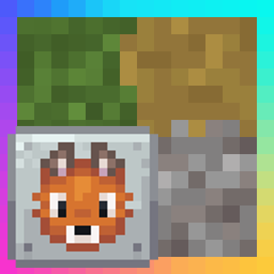

# NeoContinuity 26.1.x ([EN version](#english))

## 🍝赞助

NeoContinuity 基本由我一人在 PepperCode1 所编写的 Continuity 基础之上完成.
来自广大玩家们的赞助将用于后续的更快的新旧版本移植与改善, 感谢所有支持者!
如果你喜欢这个 MOD, 并且想要支持 NeoContinuity 的开发, 请前往 [爱发电](https://afdian.com/a/argon4w) 为狐狸买一份意面.
也十分感谢 PepperCode1 制作精良的 Continuity, 若想支持 Continuity 的开发, 请前往 [Buy Me a Coffee](https://buymeacoffee.com/peppercode1) 进行赞助.

## 🖥️模组介绍

NeoContinuity 是Continuity 的非官方分支, 旨在于让 Continuity 能在 NeoForge 26.1.x 上 (无需信雅互联) 原生地运行, 并使用NeoForge API 完全替换 Fabric API 依赖. **请勿** 向原作者报告任何游玩此模组遇到的问题.

## ✨为什么需要这个MOD

Continuity 当前的 NeoForge 支持依赖于信雅互联 (Sinytra Connector) 与 FFAPI (Forgified-Fabric-API). 信雅互联与 FFAPI 引入游戏环境后会引起诸多兼容性问题, 或导致崩溃, 并且信雅互联与 FFAPI 暂未提供 NeoForge 26.1.x 的版本支持. 基于以上原因, 我决定制作原生支持 NeoForge 26.1.x 且移除所有 Fabric API 依赖的 Continuity 分支, 即 NeoContinuity.

## ⚙️工作原理

NeoContinuity 不依赖于 FFAPI (Forgified-Fabric-API), 我将 Continuity 所使用的 Fabric API 进行了移除, 将其完全替换为原生的 NeoForge API, 减少了不必要的 JAR 体积占用和改善可能造成的兼容性问题, 让 Continuity 能够更好地融入 NeoForge 的运行环境.

## ♻️API 替换:
- Fabric 的 `emitQuads` 方法替换为 NeoForge 提供的扩展版 `collectParts` 方法.
- Fabric 的 `QuadView` 与 `MutableQuadView` 替换为 NeoForge 提供的 `MutableQuad`.
- Fabric 的 `MutableMesh` 替换为 `QuadCollectionBuilder` (可重用的 `QuadCollection$Builder`).

# NeoContinuity 26.1.x

## 🍝Sponsorship

This MOD is almost done by myself based on the Continuity codebase written by PepperCode1.
Sponsorships from players can ensure the future ports to other versions. Thanks for everyone that support this MOD! If you like it and want to support my work on development of NeoContinuity, please consider sponsor me at [爱发电](https://afdian.com/a/argon4w).
Also thanks for PepperCode1 for making such great Continuity MOD. If you want to support the development of Continuity, Please sponsor at [Buy Me a Coffee](https://buymeacoffee.com/peppercode1).

## 🖥️MOD Description

NeoContinuity is an unofficial fork of Continuity, aiming to run Continuity natively on NeoForge (without connector) and replace all FFAPI (Forgified-Fabric-API) dependencies with NeoForge API. Do **NOT** report issues encountered with this mod to the original.

## ✨Why need this MOD

NeoForge support of Continuity relies heavily on Sinytra Connector and FFAPI (Forgified-FabricAPI). Connector and FFAPI may cause compatibility issues or crashes when introduced into the environment, and they have not supported NeoForge 26.1.x yet. For these reasons, I decide to fork Continuity as NeoContinuity and make it run natively on NeoForge without Fabric API.

## ⚙️How it works

NeoContinuity does not rely on the FFAPI (Forgified-Fabric-API), I removed all FFAPI dependencies and replaced them with native NeoForge API to reduce the jar size and mitigate compatibility issues caused by FFAPI, which makes Continuity to better adapt to the NeoForge runtime environment.

## ♻️API Replacement:
- Fabric's `emitQuads` replaced with NeoForge's extended `collectParts` method.
- Fabric's `QuadView` and `MutableQuadView` replaced with NeoForge's `MutableQuad`.
- Fabric's `MutableMesh` replaced with `QuadCollectionBuilder` (Reusable `QuadCollection$Builder`).

# Continuity

Continuity is a Minecraft mod that allows resource packs that use the OptiFine connected textures format or OptiFine emissive textures format (only for blocks and item models) to work without OptiFine.

Continuity is client-side only and includes two built-in resource packs. The Default Connected Textures pack provides connected textures for glass, sandstone, and bookshelves, similar to the built-in connected textures provided by OptiFine. The Glass Pane Culling Fix pack culls faces between vertically stacked glass panes to make them look seamless with connected textures.

Formally, Continuity implements the Continuity connected textures specification, Continuity emissive textures specification, and Continuity custom block layers specification. All of these are extensions of the corresponding OptiFine specification and were created to provide more features to resource pack authors. The documentation for the Continuity specifications can be found at the [Continuity wiki](https://github.com/PepperCode1/Continuity/wiki).

Continuity is developed as a Fabric mod and is recommended to be used with Fabric. However, [Connector](https://github.com/Sinytra/Connector) and [Forgified Fabric API](https://github.com/Sinytra/ForgifiedFabricAPI) allow Continuity to work well on other mod loaders such as NeoForge and Forge. Releases are made on CurseForge and Modrinth that are marked as working with these mod loaders; these releases contain the same code as equivalent releases for Fabric, but with additional metadata to declare Connector and Forgified Fabric API as dependencies. An official NeoForge version of Continuity that does not require Forgified Fabric API is not planned at this time due to major technical differences between the Fabric and NeoForge APIs.

### Links

[CurseForge Page](https://www.curseforge.com/minecraft/mc-mods/continuity) \
[Modrinth Page](https://modrinth.com/mod/continuity) \
[Wiki](https://github.com/PepperCode1/Continuity/wiki) \
[Discord](https://discord.gg/7rnTYXu)
